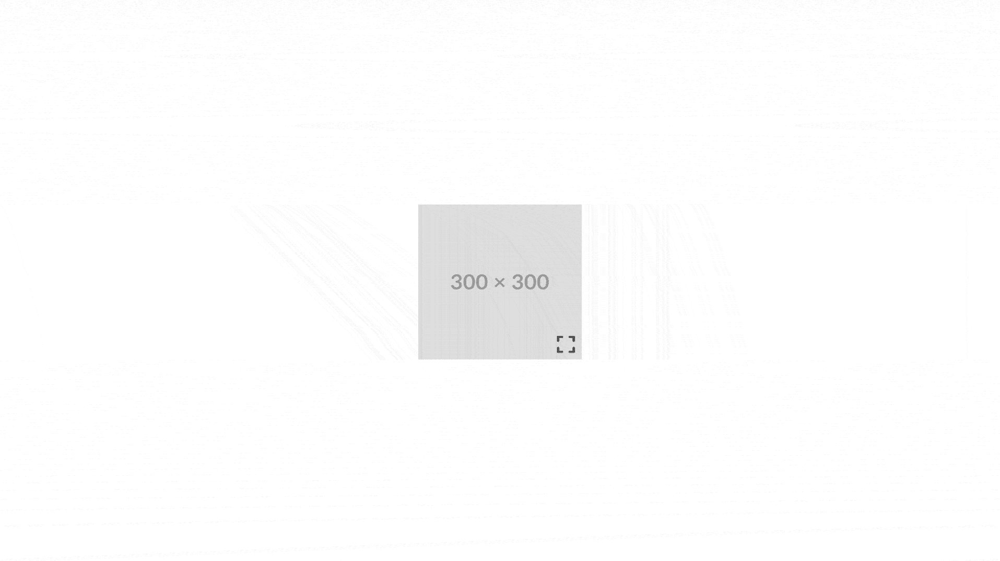

<br />
<br />

<p align="center">
  <a href="https://github.com/LeashFox/splidebox">
    
  </a>
</p>

<p align="center">
  
  
  
  
    <a href="https://www.buymeacoffee.com/leashfox" target="_blank"></a>
</p>


### Splidebox is a lightweight JavaScript library for creating customisable image lightboxes using Splide.js. Easily integrate image galleries into your web applications with minimal setup.

This project is in **early stages**. I am building a native JavaScript library that will allow you to specify which elements to turn into a lightbox and parse various options.

This project wouldn't be possible without **Naotoshi Fujita**, the developer behind **Splide**. **cure53**, the developer behind **DOMPurify**, and **Tailwind Labs**, the developers behind **Tailwind**.

Any contributions, suggestions, or feedback is welcome.

## Preview:

<p dir="auto">
    
</p>

## Dependencies:
*Theses are compiled within **dist/js/splidebox.min.js**, or imported in **src/js/splidebox.js***
- Splide (Lightweight Carousel library) - https://splidejs.com/
- Tailwind CSS - https://tailwindcss.com/docs/installation
- DOMPurify (for security when iterating through and rendering images) - https://github.com/cure53/DOMPurify

## Installation Options:

There's a few of ways that you can install it.

**Use the CDN from jsDeliver:**

- **splidebox.js:** ```<script src="https://cdn.jsdelivr.net/npm/splidebox/dist/js/splidebox.min.js"></script>```
- **splidebox.min.js:** ```<script src="https://cdn.jsdelivr.net/npm/splidebox/dist/js/splidebox.min.js"></script>```

**Download, clone, or fork this repo and use the splidebox.js under:**
- ```src/js``` or ```dist/js```

**run ```npm install splidebox``` and use either:**
- ```src/js/splidebox.js``` or ```dist/js/splidebox.min.js```

## Supported options:
- background: **object** == defaults to: {enable: true (**boolean**), backgroundColor: 'rgba(0, 0, 0, 0.7)' (**string**) }
- closeWithEscapeKey: **boolean** = defaults to "true",
- openButtonSelector: **string** = defaults to "open-splidebox",
- closeButtonSelector: **string** = defaults to "close-splidebox",
- splideboxLabel: **string** = defaults to "An image carousel." This is used to determine the aria-label attribute for the Splide carousel.
- images: **array** = defaults to empty array,
- splideOptions: **object** = can be used to pass in splide options (https://splidejs.com/guides/options/) - *Not all of them have been tested. If you encounter any bugs, please report them to me.*

## Example:

****You'll need to instantiate the class when building a Splidebox. It's best to do this after the DOM content has loaded:****

```
document.addEventListener('DOMContentLoaded', () => {

    const lightboxWrapper = document.getElementById('lightbox-wrapper');
    
    let imageArray = [
        'https://placehold.co/300x300',
        'https://placehold.co/350x350',
        'https://placehold.co/400x400',
    ]
    
    lightboxWrapper.Splidebox({
        background = {
            backgroundColor: 'rgba(0, 0, 0, 0.4)',
        },
        closeWithEscapeKey: false,
        openButtonSelector: '#product_image',
        closeButtonSelector: '#new_close_button',
        splideboxLabel: 'Product lightbox',
        images: imageArray,
        splideOptions: {
            type: 'loop',
            pagination: 'false',        
            // Any further options from Splide (https://splidejs.com/guides/options/)
        }
    })

});
```